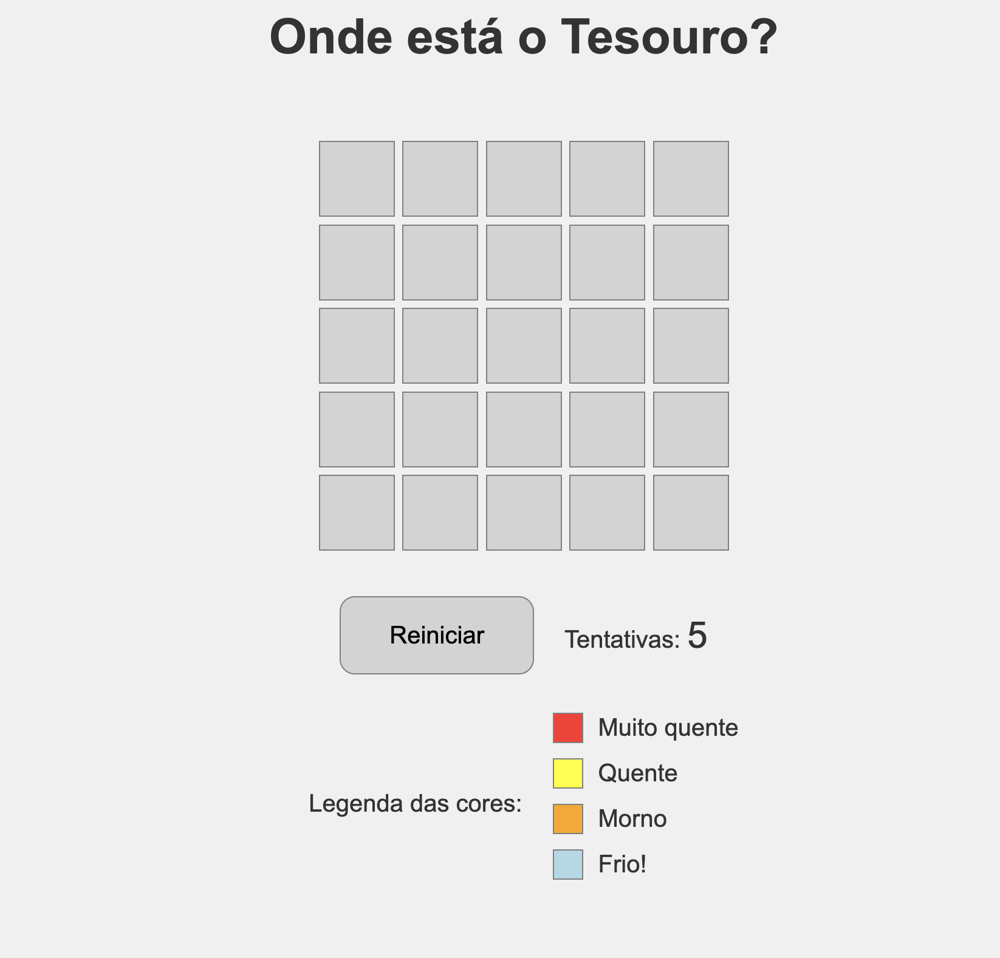
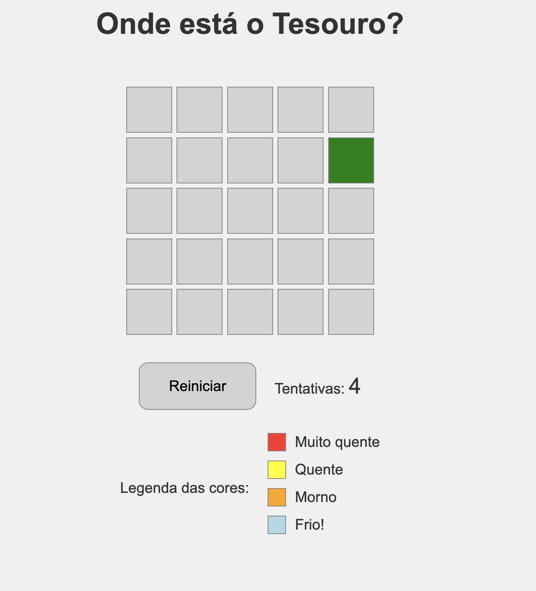
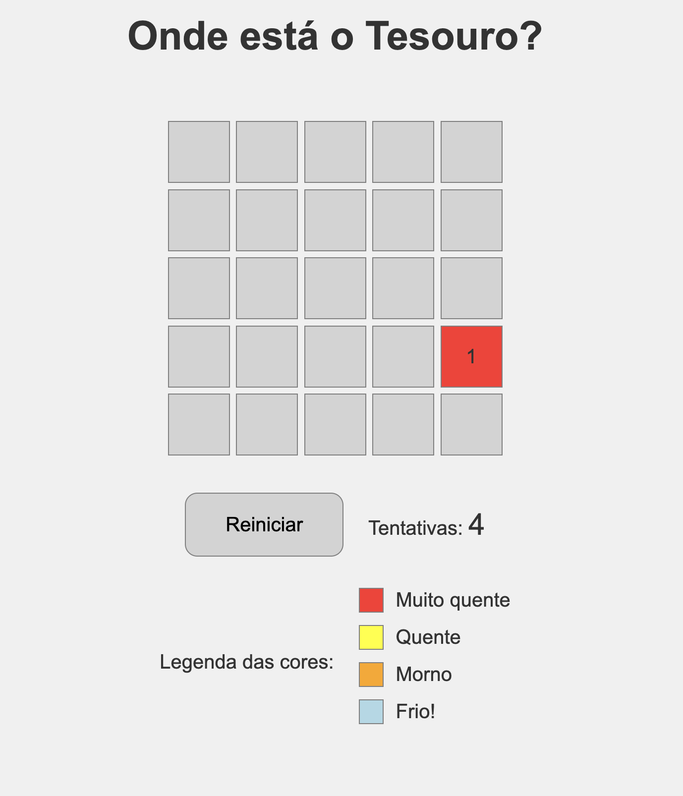
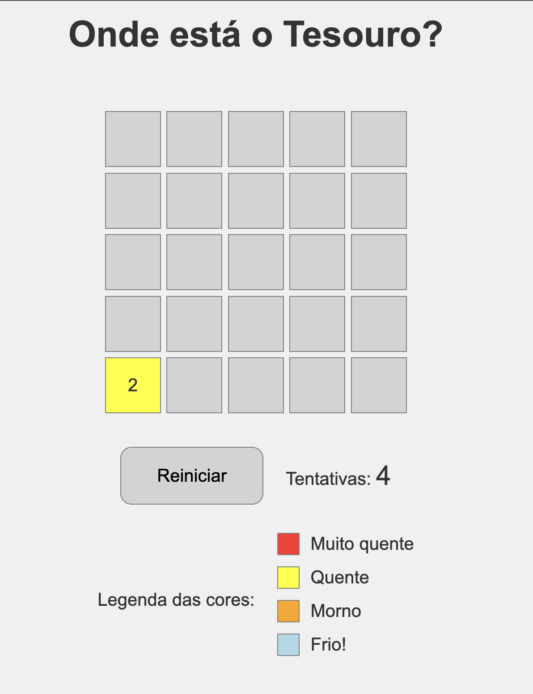
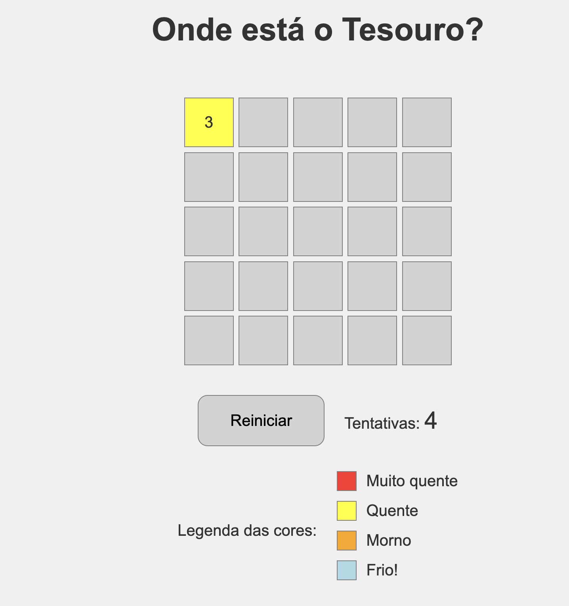
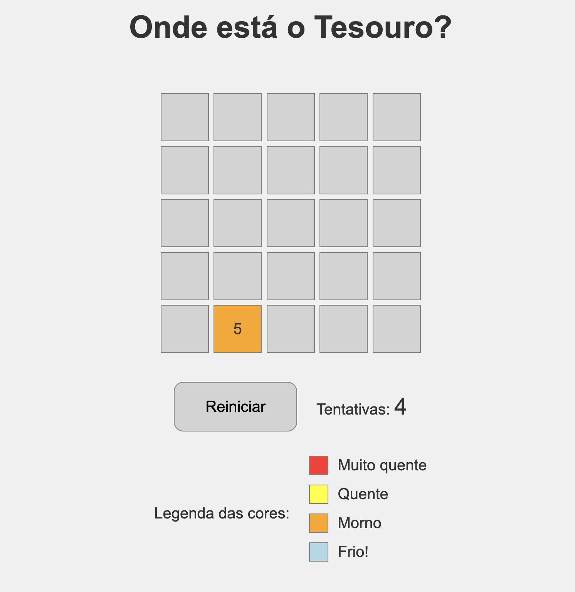
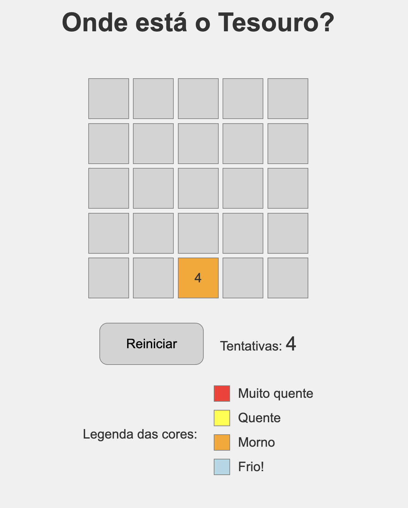
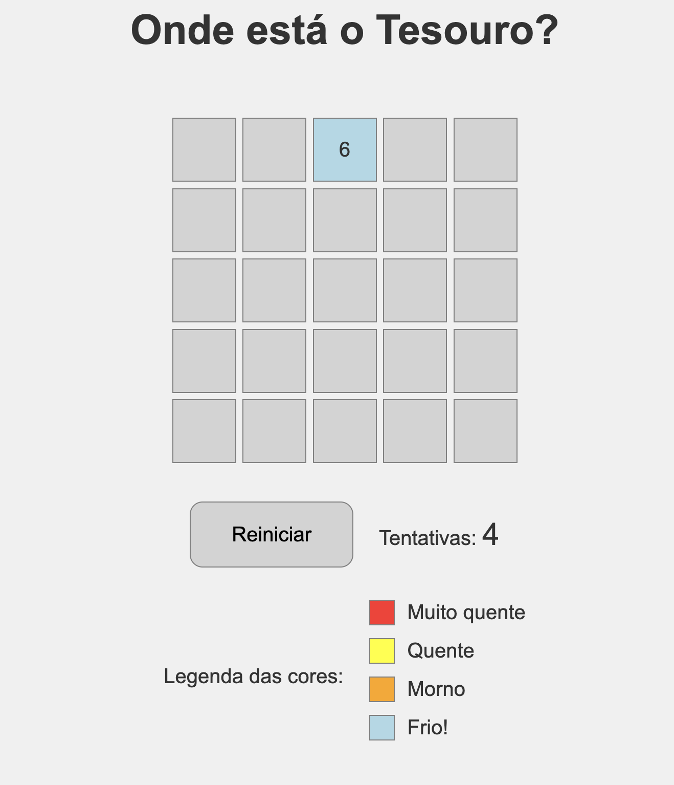
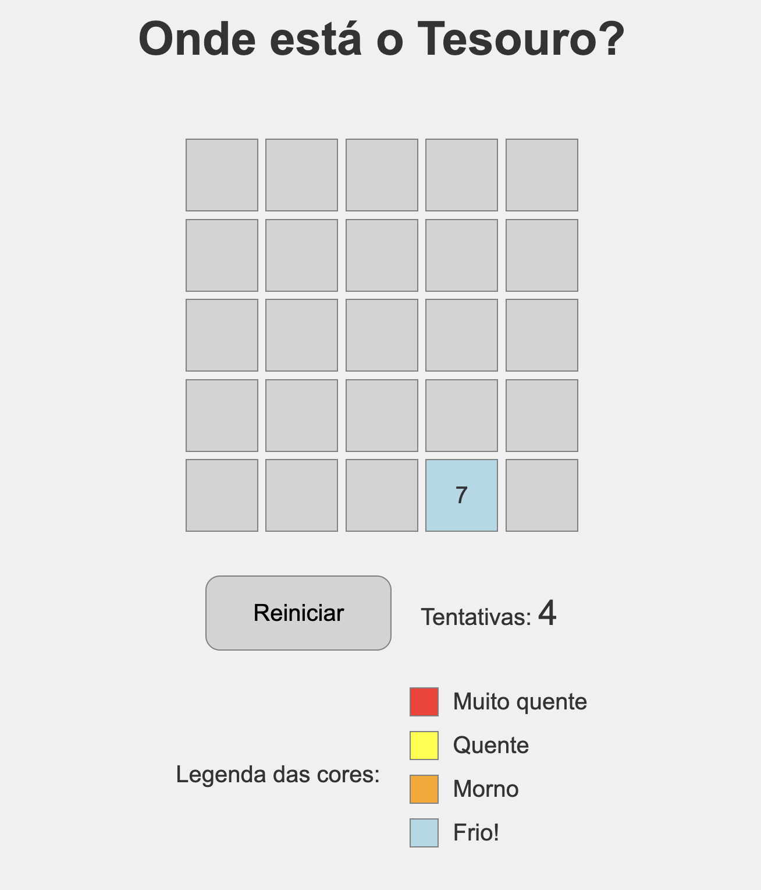
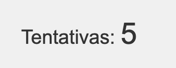

# 🗺️ Onde está o Tesouro? (Jogo Simples em JavaScript Puro)

Bem-vindo ao jogo "Onde Está o Tesouro?", um desafio de lógica e intuição construído com JavaScript puro, HTML e CSS!

Neste jogo, você precisa encontrar um tesouro escondido em um tabuleiro. A cada tentativa, o jogo te dará dicas de "quente ou frio" para guiar sua busca.

---

## 🎮 Como Jogar:

1.  **Abra o link:**
2.  **Clique nas Células:** O tabuleiro aparecerá na tela. Clique em qualquer célula para fazer sua primeira tentativa.

    

3.  **Interprete as Dicas:**

    -   **Verde:** 🎉 Parabéns! Você encontrou o tesouro!

        

    -   **Dourado:** 💔 Você perdeu as tentativas, mas o tesouro estava aqui!
    -   **Vermelho Intenso:** 🔥 Muito perto! (Distância 1)

        

    -   **Amarelo:** 🔥 Quente! (Distância 2 ou 3)

        
        

    -   **Laranja:** 🌡️ Morno! (Distância 4 ou 5)

        
        

    -   **Azul Claro:** ❄️ Frio! (Distância 6 ou mais)

        
        

4.  **Contador de Tentativas:** Fique de olho no contador de tentativas! Você tem um número limitado de cliques para encontrar o tesouro.

    

5.  **Reiniciar:** Se encontrar o tesouro ou perder todas as tentativas, clique no botão "Reiniciar Jogo" para uma nova partida com um tesouro em um novo lugar.

---

## ✨ Funcionalidades

-   **Tabuleiro Dinâmico:** Gerado automaticamente com base em dimensões configuráveis (5x5).
-   **Tesouro Aleatório:** O tesouro muda de posição a cada nova partida.
-   **Feedback Visual:** Células mudam de cor e exibem a distância para guiar o jogador.
-   **Dicas de Proximidade:** Sistema de "quente ou frio" baseado na distância de Manhattan.
-   **Contador de Tentativas:** Acompanhe quantas chances você ainda tem.
-   **Mensagens de Alerta:** Feedback claro para vitória e derrota.
-   **Revelação do Tesouro:** Ao perder, o tesouro é revelado no tabuleiro.
-   **Reinício de Jogo:** Botão para começar uma nova partida a qualquer momento.

---

## 🚀 Tecnologias Utilizadas

-   **HTML5:** Estrutura da página.
-   **CSS3:** Estilização e layout do tabuleiro (com CSS Grid).
-   **JavaScript (ES6+):** Lógica do jogo, manipulação do DOM e interação.

---

## 🛠️ Como Desenvolver / Contribuir

Se você quiser explorar o código ou fazer melhorias:

1.  **Clone o Repositório:**
    ```bash
    git clone https://github.com/williampgdias/onde-esta-o-tesouro.git
    ```
2.  **Abra os Arquivos:** Abra a pasta do projeto no seu editor de código favorito (ex: VS Code).
3.  **Execute:** Abra o arquivo `index.html` em qualquer navegador para ver o jogo em ação.

Sinta-se à vontade para explorar, modificar e aprimorar este projeto!

---

## 📧 Contato

Se tiver dúvidas, sugestões ou quiser se conectar, me encontre em:

-   **[GitHub](https://github.com/williampgdias)**
-   **[LinkedIn](https://www.linkedin.com/in/williampgdias/)**
-   **[Portfólio](https://william.tech)**

---
